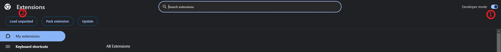

# What is this extension?

If you haven't signed up on Glassdoor.com or haven't revealed your salary or review, by default, you can't see salaries, reviews, or any other information related to the particular company you are looking for. This extension gives you the ability to view the information about the company you want to.

# How to install the extension?

1. Download the repository
2. Unzip the folder
3. Go to chrome://extensions/ and check the box for Developer mode in the top right
4. Click the Load unpacked extension button and select the unzipped folder for your extension to install it
   
